# 盼蕾平台 — 全栈开发技术图解

> **写给想快速掌握全栈开发的你**
>
> 本文档通过盼蕾项目，系统讲解现代 Web 开发涉及的所有技术。
> 
> **阅读方式**：
> - 第一遍：快速浏览，建立整体认知
> - 第二遍：带着问题，深入理解每个技术点
> - 第三遍：实践操作，亲手写代码

---

## 目录

1. [项目全景图](#一项目全景图)
2. [技术栈详解](#二技术栈详解)
3. [前端技术深入](#三前端技术深入)
4. [后端技术深入](#四后端技术深入)
5. [数据库与 ORM](#五数据库与 orm)
6. [认证与授权](#六认证与授权)
7. [缓存与 Redis](#七缓存与 redis)
8. [容器化与部署](#八容器化与部署)
9. [多租户架构](#九多租户架构)
10. [API 设计规范](#十 api 设计规范)
11. [硬件通信技术](#十一硬件通信技术)
12. [AI 大模型对接](#十二 ai 大模型对接)

---

## 一、项目全景图

> ### 📚 本节学习目标
> 学完本节后，你将能够：
> - 用一句话向别人介绍这个项目是做什么的
> - 看懂系统架构图，知道每个组件的作用
> - 理解用户登录时，数据是如何在各个组件之间流动的
>
> ### 💡 核心概念解释
> | 名词 | 通俗解释 | 生活中的比喻 |
> |------|----------|-------------|
> | **Nginx** | 反向代理服务器 | 公司的「前台接待员」，所有来访者先经过它，再转接给对应部门 |
> | **后端 (NestJS)** | 业务逻辑处理 | 公司的「业务部门」，真正干活的地方 |
> | **MySQL** | 关系型数据库 | 公司的「档案室」，永久存储重要文件 |
> | **Redis** | 缓存数据库 | 办公桌的「便利贴」，临时记录常用信息，取用更快 |
> | **JWT Token** | 身份凭证 | 电影院的「手环」，戴上后进场无需反复验票 |
>
> ### ❓ 为什么要这样设计？
> 1. **为什么要用 Nginx 做网关？** —— 动静分离，让专业的做专业的事。Nginx 处理静态文件（HTML/CSS/JS）效率极高，后端专注业务逻辑
> 2. **为什么需要 Redis？** —— 数据库查询像去仓库取货（~10ms），缓存像从口袋掏东西（~0.1ms），热点数据放 Redis 能快 100 倍
> 3. **为什么用 JWT 而不是 Session？** —— JWT 像电子手环，Session 像纸质票根。JWT 无需服务端存储，天然支持分布式部署
>
> ### ✅ 关键要点速记
> - 数据流向：**浏览器 → Nginx → 后端 → MySQL/Redis → 返回**
> - 登录流程：**账号密码 → 验证 → 生成 Token → 前端保存 → 后续请求自动携带**
> - 多租户隔离：**每个数据都带 tenantId，像给文件贴标签**
>
> ---

### 1.1 一句话理解

**盼蕾平台 = 一个中医/医学在线考试系统**

```
用户角色与核心流程

学生：登录 → 看考试 → 答题 → 查成绩
教师：登录 → 出题目 → 组试卷 → 发考试 → 看成绩
管理员：用户管理 + 机构管理 + 权限控制
```

### 1.2 系统架构全景

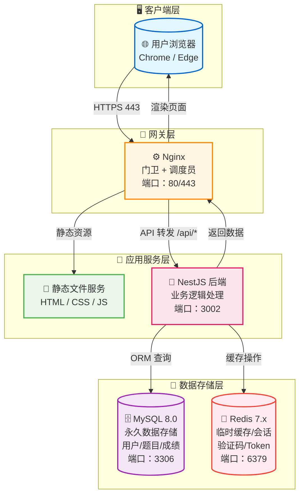

### 1.3 用户登录数据流向

```mermaid
sequenceDiagram
    participant User as 👤 用户
    participant Front as 💻 前端<br/>LoginView.vue
    participant API as 🔌 API 接口
    participant Nginx as 🚪 Nginx
    participant Controller as 🎯 AuthController
    participant Service as ⚙️ AuthService
    participant DB as 🗄️ MySQL
    participant JWT as 🔐 JWT

    User->>Front: 1. 输入账号密码<br/>admin / admin123
    Front->>API: 2. POST /api/auth/login
    API->>Nginx: 3. HTTPS 请求
    Nginx->>Controller: 4. 转发到 localhost:3002
    Controller->>Service: 5. 验证账号密码
    Service->>DB: 6. SELECT * FROM User
    DB-->>Service: 7. 返回用户数据
    Service->>Service: 8. bcrypt 验证密码
    Service->>JWT: 9. 生成 Token
    JWT-->>Service: 10. 返回 signed token
    Service-->>Controller: 11. {token, user}
    Controller-->>Nginx: 12. HTTP 响应
    Nginx-->>API: 13. 返回结果
    API-->>Front: 14. code:200, data:{...}
    Front->>Front: 15. 保存 token 到<br/>localStorage
    Front->>User: 16. 跳转首页
    Note over Front,API: 后续请求自动携带<br/>Authorization: Bearer {token}

    style User fill:#e1f5ff,stroke:#0066cc
    style Front fill:#e8f5e9,stroke:#4caf50
    style API fill:#fff3e1,stroke:#ff8800
    style Nginx fill:#f3e5f5,stroke:#9c27b0
    style Controller fill:#fce4ec,stroke:#e91e63
    style Service fill:#fff9c4,stroke:#fbc02d
    style DB fill:#ffebee,stroke:#f44336
    style JWT fill:#e0f2f1,stroke:#009688
```

---

## 二、技术栈详解

> ### 📚 本节学习目标
> 学完本节后，你将能够：
> - 说出前端、后端分别用了哪些技术
> - 理解为什么选这些技术，而不是其他
> - 看懂技术选型决策树，明白每个选择的权衡
>
> ### 💡 核心概念解释
> | 名词 | 通俗解释 | 生活中的比喻 |
> |------|----------|-------------|
> | **Vue 3** | 前端框架 | 建房子的「预制件」，不用从搬砖开始，直接用现成的组件 |
> | **TypeScript** | 带类型的 JavaScript | 带「安全检查」的编程，写错类型编译时就报错 |
> | **Vite** | 构建工具 | 「秒启动」的开发服务器，比 Webpack 快 10 倍 |
> | **NestJS** | 后端框架 | 后端的「脚手架」，帮你把代码组织得井井有条 |
> | **Prisma** | ORM 工具 | 数据库的「翻译官」，用 JavaScript 写查询，自动转成 SQL |
>
> ### ❓ 为什么要这样设计？
> 1. **为什么选 Vue 3 而不是 React？** —— Vue 的组合式 API 更直观，学习曲线平缓，适合快速上手
> 2. **为什么用 TypeScript？** —— 90% 的低级错误（拼写错误、类型不匹配）在编译时就能发现，减少运行时 Bug
> 3. **为什么用 Prisma 而不是直接写 SQL？** —— 自动类型提示，表名/字段名写错立刻报错，还能防止 SQL 注入
>
> ### ✅ 关键要点速记
> - 前端三剑包：**Vue 3（框架）+ TypeScript（类型）+ Vite（构建）**
> - 后端三剑包：**NestJS（框架）+ Prisma（ORM）+ MySQL（存储）**
> - 技术选型原则：**开发效率 > 类型安全 > 生态成熟 > 性能扩展**
>
> ---

### 2.1 前端技术栈

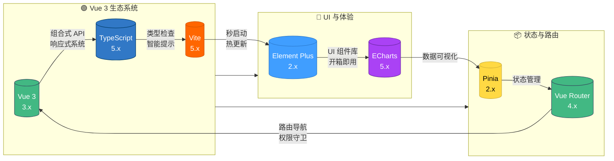

### 2.2 后端技术栈

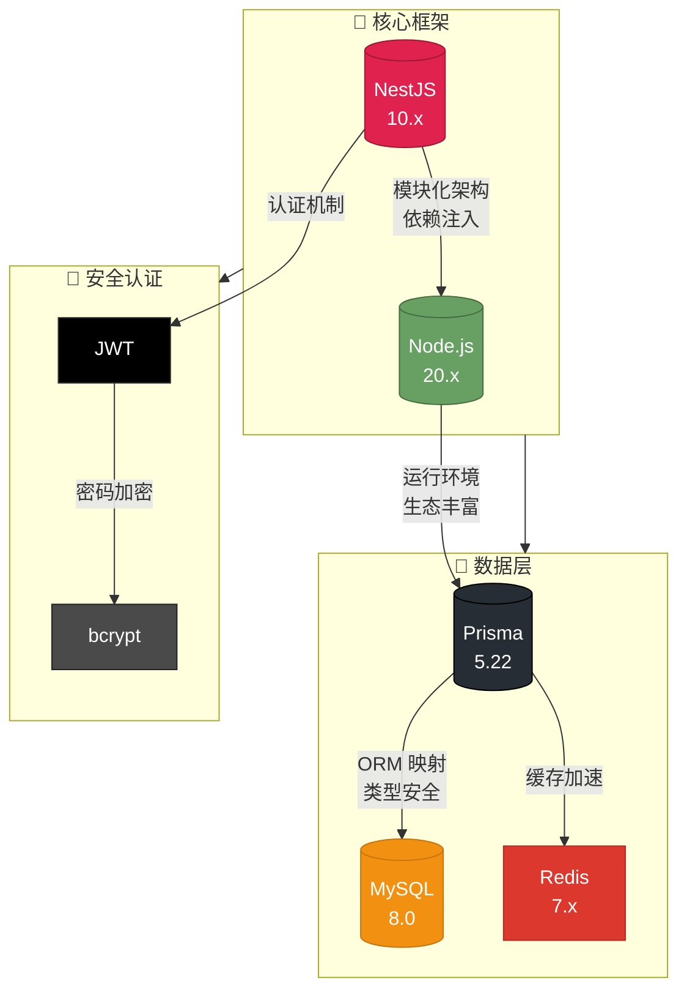

### 2.3 技术选型决策树

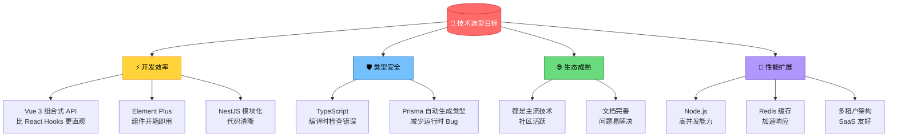

---

## 三、前端技术深入

> ### 📚 本节学习目标
> 学完本节后，你将能够：
> - 理解 Vue 3 组合式 API 相比传统写法的优势
> - 看懂响应式数据是如何自动更新视图的
> - 掌握组件之间如何传递数据
> - 理解路由守卫如何保护页面权限
>
> ### 💡 核心概念解释
> | 名词 | 通俗解释 | 生活中的比喻 |
> |------|----------|-------------|
> | **组合式 API** | 把相关代码组织在一起 | 整理衣柜：把上衣、裤子、配饰分类放，而不是按颜色分散放 |
> | **响应式** | 数据变，页面自动更新 | Excel 表格：改了一个单元格，相关公式的结果自动更新 |
> | **ref/reactive** | 让数据变成响应式 | 给普通变量装个「追踪器」，值变化时通知页面更新 |
> | **Pinia** | 全局状态管理 | 公司的「公告板」，任何部门都能读取和更新共享信息 |
> | **路由守卫** | 进入页面前的检查 | 小区门禁：先确认你是业主（登录），再有权限进对应楼栋 |
>
> ### ❓ 为什么要这样设计？
> 1. **为什么用组合式 API 而不是 Options API？** —— 大型组件中，相关逻辑可以放在一起，不用在 data/methods/computed 之间来回跳转
> 2. **为什么需要 Pinia？** —— 兄弟组件通信时，通过父组件传递太麻烦，不如直接读写共享状态
> 3. **为什么路由守卫必不可少？** —— 防止用户手动输入 URL 访问未授权页面，保护系统安全
>
> ### ✅ 关键要点速记
> - 组件通信：**父子用 Props/Events，兄弟用 Pinia**
> - 响应式核心：**ref 用于基本类型，reactive 用于对象**
> - 权限控制：**路由守卫 = 登录检查 + 权限检查**
>
> ---

### 3.1 Vue 3 组合式 API vs Options API

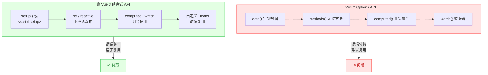

### 3.2 响应式原理对比

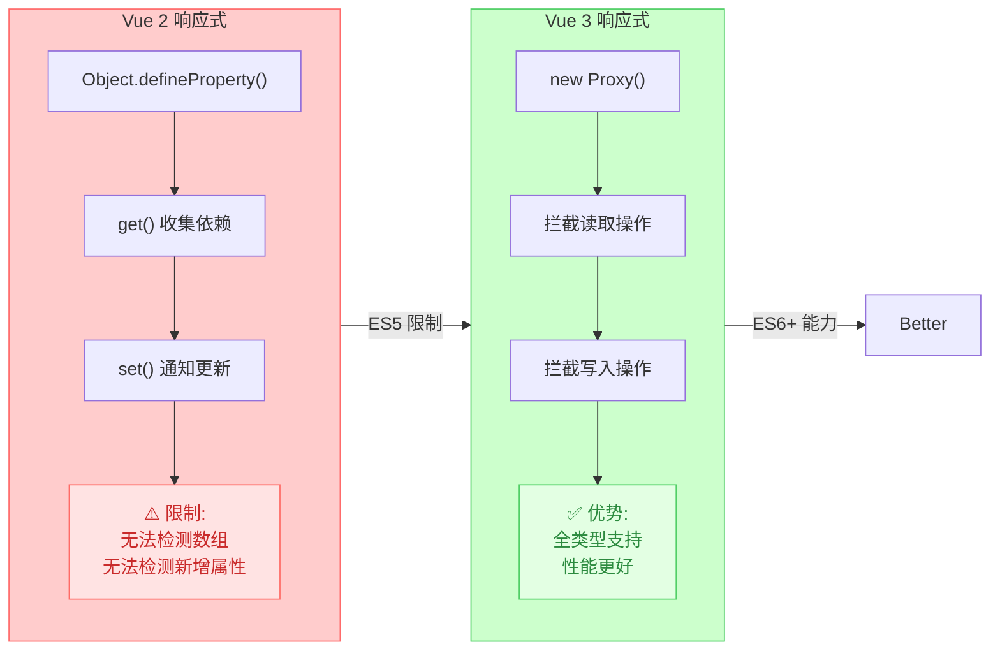

### 3.3 组件通信模式

```mermaid
graph TB
    subgraph ParentChild["父子组件通信"]
        Parent["📄 父组件<br/>UsersView.vue"]
        Child["📄 子组件<br/>UserTable"]
        Parent -->|Props ↓<br/>:users="users" | Child
        Child -->|Events ↑<br/>@delete="handle" | Parent
    end

    subgraph Sibling["兄弟组件通信"]
        Store["📦 Pinia Store<br/>共享状态中心"]
        SiblingA["📄 组件 A"]
        SiblingB["📄 组件 B"]
        SiblingC["📄 组件 C"]
        SiblingA -->|写入 | Store
        Store -->|读取 + 自动更新 | SiblingB
        Store -->|读取 + 自动更新 | SiblingC
    end

    ParentChild --> Sibling

    style Parent fill:#e8f5e9,stroke:#4caf50
    style Child fill:#e3f2fd,stroke:#2196f3
    style Store fill:#fff3e1,stroke:#ff9800
    style SiblingA fill:#f3e5f5,stroke:#9c27b0
    style SiblingB fill:#f3e5f5,stroke:#9c27b0
    style SiblingC fill:#f3e5f5,stroke:#9c27b0
```

### 3.4 路由守卫执行流程

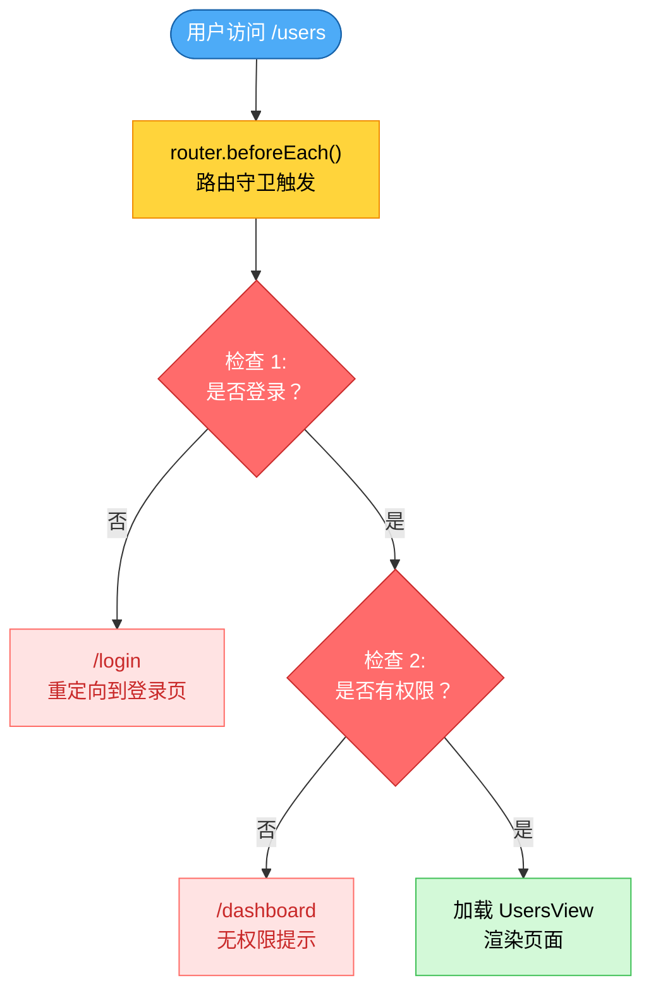

---

## 四、后端技术深入

> ### 📚 本节学习目标
> 学完本节后，你将能够：
> - 看懂 NestJS 的分层架构，知道请求是如何一层层处理的
> - 理解依赖注入解决了什么问题
> - 知道各种装饰器的作用和使用场景
>
> ### 💡 核心概念解释
> | 名词 | 通俗解释 | 生活中的比喻 |
> |------|----------|-------------|
> | **NestJS** |  Node.js 后端框架 | 公司的「组织架构」，明确每个部门的职责 |
> | **依赖注入** | 框架帮你创建和传递依赖 | 公司配电脑：不用自己买，入职时 IT 部门直接发给你 |
> | **Controller** | 控制器，处理请求 | 公司的「接待窗口」，接收外部请求 |
> | **Service** | 服务层，业务逻辑 | 公司的「业务部门」，真正干活的地方 |
> | **Guard** | 守卫，权限验证 | 公司的「保安」，检查你有没有门禁卡 |
> | **Interceptor** | 拦截器，处理响应 | 公司的「前台」，所有 outgoing 的文件都经过它打包 |
> | **Filter** | 过滤器，异常处理 | 公司的「客服」，统一处理客户投诉 |
> | **Pipe** | 管道，参数验证 | 公司的「安检」，检查你带的东西是否符合要求 |
>
> ### ❓ 为什么要这样设计？
> 1. **为什么要分层？** —— 职责分离，Controller 只负责接收请求，Service 负责业务逻辑，便于测试和维护
> 2. **为什么用依赖注入？** —— 不用自己 new 对象，框架自动管理依赖关系，测试时可以轻松替换 Mock
> 3. **为什么需要 Guard/Interceptor/Filter/Pipe？** —— 横切关注点分离，日志、权限、验证等逻辑不用重复写
>
> ### ✅ 关键要点速记
> - 请求流程：**Request → Guard → Interceptor → Pipe → Controller → Service → DB**
> - 依赖注入核心：**@Injectable() + Constructor 注入**
> - 装饰器分类：**路由 (@Get/@Post)、参数 (@Body/@Query)、元数据 (@UseGuards/@Roles)**
>
> ---

### 4.1 NestJS 架构全景

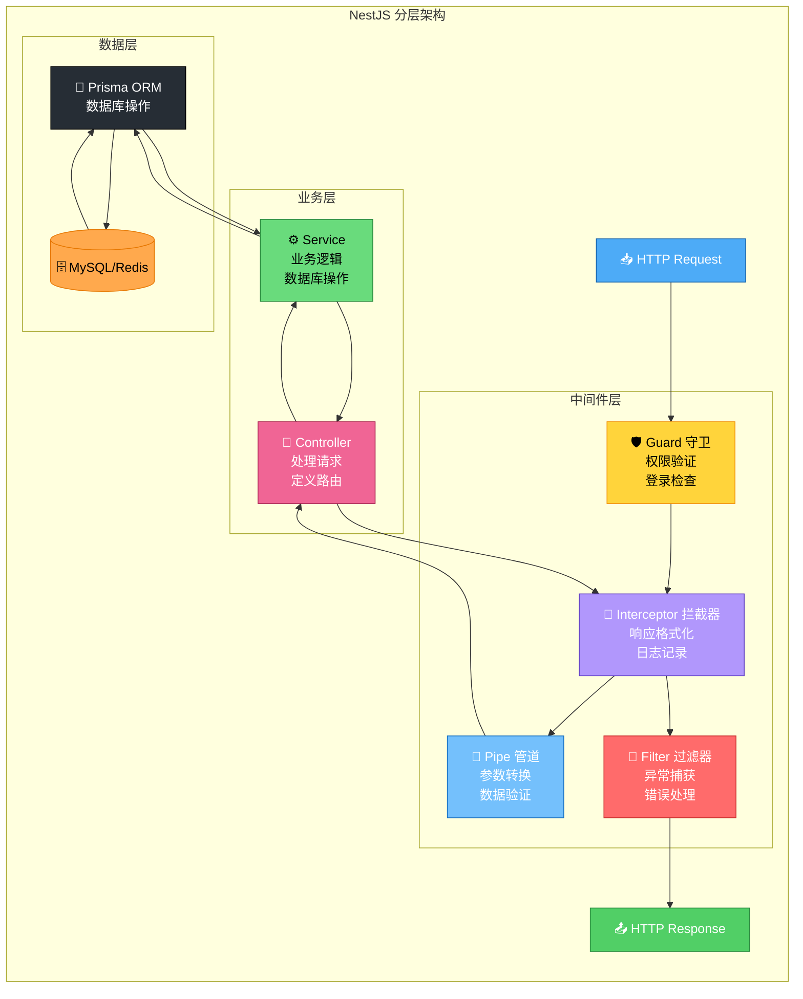

### 4.2 依赖注入原理

```mermaid
graph TB
    subgraph Traditional["🔴 传统方式"]
        T1["class UserService {"]
        T2["  private db = new Database()"]
        T3["  private cache = new Redis()"]
        T4["}"]
        T1 --> T2 --> T3 --> T4
        TIssue["❌ 问题:<br/>难以测试<br/>难以维护<br/>难以替换"]
        T4 --> TIssue
    end

    subgraph DI["🟢 依赖注入"]
        D1["@Injectable()"]
        D2["class UserService {"]
        D3["  constructor("]
        D4["    private db: Database,"]
        D5["    private cache: Redis"]
        D6["  ) {}"]
        D7["}"]
        D1 --> D2 --> D3 --> D4 --> D5 --> D6 --> D7
        DAdv["✅ 优势:<br/>易于测试<br/>代码解耦<br/>灵活替换"]
        D7 --> DAdv
    end

    style Traditional fill:#ffe3e3,stroke:#ff6b6b
    style DI fill:#e3ffe3,stroke:#51cf66
    style TIssue fill:#ffe3e3,stroke:#ff6b66,color:#c92a2a
    style DAdv fill:#e3ffe3,stroke:#51cf66,color:#2b8a3e
```

### 4.3 装饰器分类

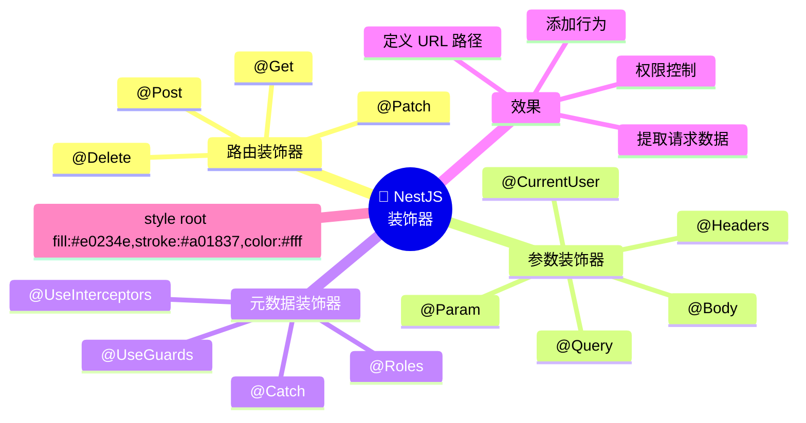

---

## 五、数据库与 ORM

> ### 📚 本节学习目标
> 学完本节后，你将能够：
> - 看懂数据库表关系图，理解表与表之间的关联
> - 理解 ORM 相比原生 SQL 的优势
> - 掌握数据库迁移的基本流程
>
> ### 💡 核心概念解释
> | 名词 | 通俗解释 | 生活中的比喻 |
> |------|----------|-------------|
> | **ORM** | 对象关系映射 | 「翻译官」：把 JavaScript 对象「翻译」成 SQL 语句 |
> | **Prisma** | 新一代 ORM 工具 | 「智能翻译官」：能自动提示表名/字段名，写错立即报错 |
> | **迁移 (Migration)** | 数据库结构版本控制 | 「房屋改建图纸」：记录每次加房间/改格局的历史 |
> | **外键 (FK)** | 关联其他表的字段 | 「超链接」：点击后能跳转到关联的内容 |
> | **一对多 (1:N)** | 一个对应多个 | 「班级 - 学生」：一个班级有多个学生 |
>
> ### ❓ 为什么要这样设计？
> 1. **为什么用 ORM 而不是直接写 SQL？** —— 类型安全（写错字段名编译时报错）、自动补全、防止 SQL 注入
> 2. **为什么需要数据库迁移？** —— 多人协作时，保证每个人的数据库结构一致；版本回滚时可追溯
> 3. **为什么表里都有 tenantId？** —— 多租户架构要求，用 tenantId 隔离不同机构的数据
>
> ### ✅ 关键要点速记
> - 表关系：**Organization 1:N User/Question/Paper/Exam**
> - Prisma 查询：**where（条件）+ include（联表）+ orderBy（排序）**
> - 迁移命令：**修改 schema → pnpm db:migrate → 生成新迁移文件**
>
> ---

### 5.1 数据库表关系图

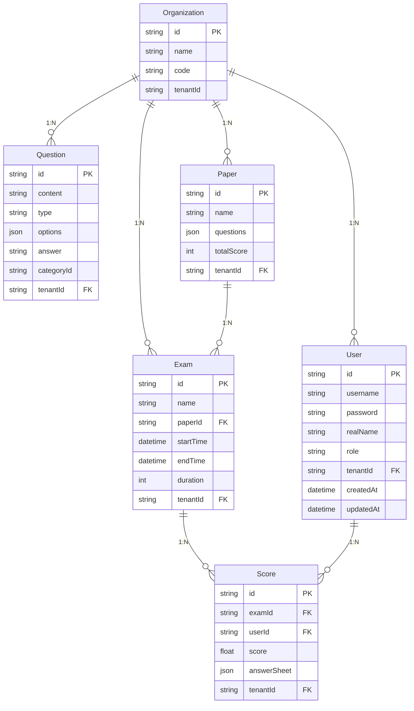

### 5.2 Prisma ORM vs 原生 SQL

```mermaid
graph LR
    subgraph RawSQL["🔴 原生 SQL"]
        SQL1["const sql = `"]
        SQL2["SELECT u.*, o.name"]
        SQL3["FROM User u"]
        SQL4["LEFT JOIN Organization o"]
        SQL5["WHERE u.tenantId = $1"]
        SQL6["ORDER BY u.createdAt"]
        SQL7["`;"]
        SQL1 --> SQL2 --> SQL3 --> SQL4 --> SQL5 --> SQL6 --> SQL7
        SQLProb["❌ 无类型检查<br/>容易拼写错误<br/>难以维护"]
    end

    subgraph Prisma["🟢 Prisma ORM"]
        P1["await prisma.user"]
        P2[".findMany({"]
        P3["  where: { tenantId, role },"]
        P4["  include: { organization: true },"]
        P5["  orderBy: { createdAt: 'desc' }"]
        P6["});"]
        P1 --> P2 --> P3 --> P4 --> P5 --> P6
        PAdv["✅ 类型安全<br/>自动补全<br/>易于重构"]
    end

    style RawSQL fill:#ffe3e3,stroke:#ff6b6b
    style Prisma fill:#e3ffe3,stroke:#51cf66
    style SQLProb fill:#ffe3e3,stroke:#ff6b66,color:#c92a2a
    style PAdv fill:#e3ffe3,stroke:#51cf66,color:#2b8a3e
```

### 5.3 数据库迁移流程

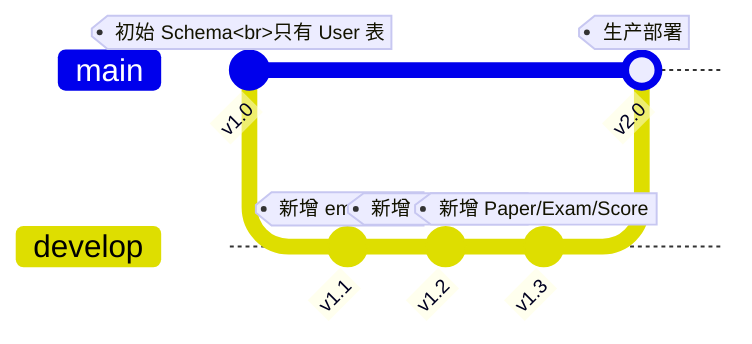

---

## 六、认证与授权

> ### 📚 本节学习目标
> 学完本节后，你将能够：
> - 理解 JWT Token 的结构和工作原理
> - 看懂完整的认证流程图
> - 理解 RBAC 角色权限模型是如何控制访问的
>
> ### 💡 核心概念解释
> | 名词 | 通俗解释 | 生活中的比喻 |
> |------|----------|-------------|
> | **认证 (Authentication)** | 验证你是谁 | 「身份证检查」：证明你是你本人 |
> | **授权 (Authorization)** | 验证你能做什么 | 「门禁权限」：即使你是业主，也只能进你买的楼栋 |
> | **JWT** | JSON Web Token | 「电子手环」：戴上后进场无需反复验票 |
> | **bcrypt** | 密码加密算法 | 「碎纸机」：密码打碎后存储，无法还原 |
> | **RBAC** | 基于角色的访问控制 | 「职位说明书」：什么职位有什么权限 |
>
> ### ❓ 为什么要这样设计？
> 1. **为什么密码要 bcrypt 加密？** —— 防止数据库泄露后密码裸奔；bcrypt 是单向加密，无法逆向破解
> 2. **为什么 JWT 比 Session 好？** —— Session 需要服务端存储，用户多了内存爆炸；JWT 无状态，天然支持分布式
> 3. **为什么需要 RBAC？** —— 权限管理规范化，新增用户时只需分配角色，不用逐个配置权限
>
> ### ✅ 关键要点速记
> - JWT 结构：**Header（算法）.Payload（用户信息）.Signature（签名验证）**
> - 认证流程：**登录 → 验证密码 → 生成 Token → 前端保存 → 后续请求自动携带**
> - 角色层级：**SUPER_ADMIN > TENANT_ADMIN > TEACHER > STUDENT**
>
> ---

### 6.1 JWT Token 结构

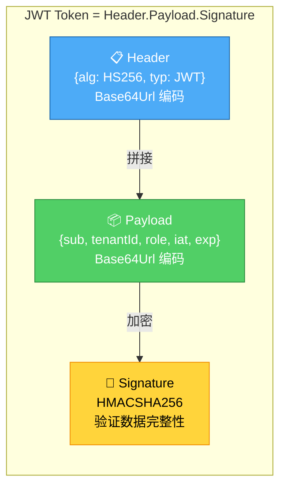

### 6.2 认证流程时序图

```mermaid
sequenceDiagram
    participant User as 👤 用户
    participant Front as 💻 前端
    participant Back as 🔙 后端
    participant DB as 🗄️ 数据库

    User->>Front: 1. 输入账号密码
    Front->>Back: 2. POST /api/auth/login
    Back->>DB: 3. 查询用户
    DB-->>Back: 4. 返回用户数据
    Back->>Back: 5. bcrypt 验证密码
    Back->>Back: 6. JWT.sign 生成 Token
    Back-->>Front: 7. 返回{token, user}
    Front->>Front: 8. 保存 localStorage
    Front->>User: 9. 跳转首页
    Note over Front,Back: 后续请求携带<br/>Authorization: Bearer {token}
    User->>Front: 10. 访问其他页面
    Front->>Back: 11. 请求带 Token
    Back->>Back: 12. JWT Guard 验证
    Back->>Back: 13. @CurrentUser 提取用户
    Back-->>Front: 14. 返回数据

    style User fill:#e1f5ff,stroke:#0066cc
    style Front fill:#e8f5e9,stroke:#4caf50
    style Back fill:#fff3e1,stroke:#ff8800
    style DB fill:#f3e5f5,stroke:#9c27b0
```

### 6.3 RBAC 角色权限模型

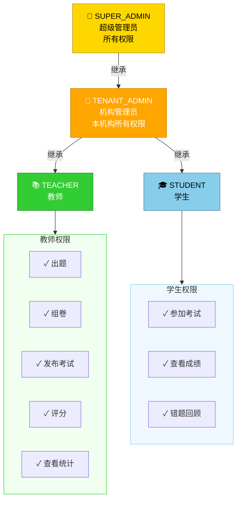

---

## 七、缓存与 Redis

> ### 📚 本节学习目标
> 学完本节后，你将能够：
> - 理解缓存命中的工作流程
> - 知道 Redis 在项目中的具体应用场景
> - 掌握设置缓存 TTL 的原则
>
> ### 💡 核心概念解释
> | 名词 | 通俗解释 | 生活中的比喻 |
> |------|----------|-------------|
> | **缓存** | 临时存储热点数据 | 「办公桌上的文件」：常用的放手边，不常用的放档案室 |
> | **Redis** | 内存数据库 | 「超级速记员」：所有数据放内存里，读取速度极快 |
> | **TTL** | 生存时间 (Time To Live) | 「食品保质期」：到期后自动失效，不用手动清理 |
> | **缓存命中** | 请求的数据在缓存里 | 「去口袋掏东西」：不用去仓库取，秒拿 |
> | **缓存穿透** | 请求的数据缓存和数据库都没有 | 「白跑一趟」：查无此数据，可能被恶意攻击 |
>
> ### ❓ 为什么要这样设计？
> 1. **为什么需要 Redis 缓存？** —— MySQL 查询 ~10ms，Redis 查询 ~0.1ms，热点数据缓存后响应快 100 倍
> 2. **为什么缓存要设 TTL？** —— 防止数据过期导致不一致；防止内存无限增长
> 3. **为什么验证码要存 Redis？** —— 验证码只需要 5 分钟有效期，Redis 的 TTL 功能完美匹配
>
> ### ✅ 关键要点速记
> - 缓存流程：**先查 Redis → 命中直接返回 → 未命中查 DB → 写入 Redis**
> - 应用场景：**验证码/频率限制/Token 黑名单/热点数据**
> - TTL 设置原则：**经常变的数据设短些 (5-30 分钟)，不常变的设长些 (1-24 小时)**
>
> ---

### 7.1 缓存命中流程

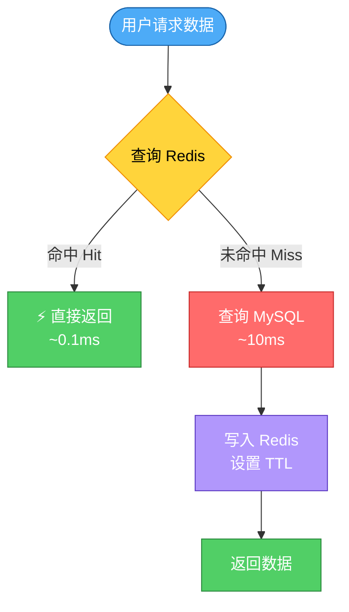

### 7.2 Redis 应用场景

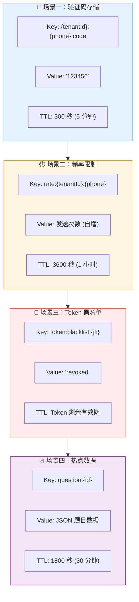

---

## 八、容器化与部署

> ### 📚 本节学习目标
> 学完本节后，你将能够：
> - 理解 Docker 容器的架构和优势
> - 看懂生产部署的完整流程
> - 知道容器重启和故障排查的基本方法
>
> ### 💡 核心概念解释
> | 名词 | 通俗解释 | 生活中的比喻 |
> |------|----------|-------------|
> | **Docker** | 容器化技术 | 「集装箱」：把应用和依赖打包，任何地方都能运行 |
> | **容器** | 运行中的实例 | 「运行的集装箱」：有独立的空间和资源 |
> | **镜像** | 容器的模板 | 「集装箱设计图纸」：用来生成容器 |
> | **Docker Compose** | 多容器编排工具 | 「工地总指挥」：同时管理多个集装箱的搭建和运行 |
> | **持久化** | 数据不随容器删除而丢失 | 「仓库独立于集装箱」：集装箱拆了，仓库里的东西还在 |
>
> ### ❓ 为什么要这样设计？
> 1. **为什么用 Docker？** —— 「在我电脑上能跑，服务器上跑不了」的问题彻底解决；打包后任何地方都能运行
> 2. **为什么容器要分层？** —— 前端 (Nginx)、后端 (Node.js)、数据库 (MySQL)、缓存 (Redis) 各自独立，互不干扰
> 3. **为什么数据要持久化？** —— 容器可以随时删除重建，但数据不能丢；通过挂载卷实现数据与容器分离
>
> ### ✅ 关键要点速记
> - 容器架构：**Frontend(Nginx) + Backend(NestJS) + MySQL + Redis**
> - 部署流程：**本地构建 → 上传服务器 → docker-compose up -d**
> - 常用命令：**docker ps(查看状态) / docker logs(看日志) / docker restart(重启)**
>
> ---

### 8.1 Docker 容器架构

```mermaid
graph TB
    subgraph Host["🖥️ 宿主机"]
        subgraph Docker["Docker Engine"]
            subgraph Frontend["panlei-frontend 容器"]
                F1["Nginx<br/>80/443"]
                F2["前端静态文件"]
                F3["SSL 证书"]
            end

            subgraph Backend["panlei-backend 容器"]
                B1["NestJS<br/>3002"]
                B2["Node.js Runtime"]
                B3["业务代码"]
            end

            subgraph MySQL["panlei-mysql 容器"]
                M1["MySQL<br/>3306"]
                M2["panlei 数据库"]
                M3["数据卷持久化"]
            end

            subgraph Redis["panlei-redis 容器"]
                R1["Redis<br/>6379"]
                R2["缓存数据"]
            end
        end
    end

    style Host fill:#f0f0f0,stroke:#666
    style Docker fill:#e0e0e0,stroke:#333
    style Frontend fill:#e8f5e9,stroke:#4caf50
    style Backend fill:#fce4ec,stroke:#e91e63
    style MySQL fill:#f3e5f5,stroke:#9c27b0
    style Redis fill:#ffebee,stroke:#f44336
```

### 8.2 生产部署流程

```mermaid
flowchart LR
    Dev["💻 本地<br/>开发环境"] -->|"1. Git 提交<br/>git add/commit/tag"| Git["📦 Git<br/>仓库"]
    Git -->|"2. 本地构建<br/>pnpm build"| Build["🔨 构建<br/>产物"]
    Build -->|"3. 上传<br/>sync.sh"| Server["🖥️ 生产<br/>服务器"]
    Server -->|"4. 重启容器<br/>docker compose up -d"| Deploy["🚀 部署<br/>完成"]
    Deploy -->|"5. 验证<br/>curl 测试"| Verify["✅ 验证<br/>成功"]

    style Dev fill:#e8f5e9,stroke:#4caf50
    style Git fill:#fff3e1,stroke:#ff9800
    style Build fill:#e3f2fd,stroke:#2196f3
    style Server fill:#f3e5f5,stroke:#9c27b0
    style Deploy fill:#fce4ec,stroke:#e91e63
    style Verify fill:#d3f9d8,stroke:#40c057
```

---

## 九、多租户架构

> ### 📚 本节学习目标
> 学完本节后，你将能够：
> - 理解多租户架构的核心概念
> - 看懂数据隔离的实现方式
> - 知道为什么所有查询都必须带 tenantId
>
> ### 💡 核心概念解释
> | 名词 | 通俗解释 | 生活中的比喻 |
> |------|----------|-------------|
> | **多租户** | 一套系统服务多个客户 | 「公寓楼」：同一栋楼里住很多户人家，每户有独立空间 |
> | **租户 (Tenant)** | 使用系统的独立组织 | 「公寓里的住户」：每个住户独立使用自己的房间 |
> | **数据隔离** | 不同租户的数据互不可见 | 「隔音墙」：你能听到自己房间的声音，听不到邻居的 |
> | **tenantId** | 租户的唯一标识 | 「门牌号」：凭这个找到对应的房间 |
> | **SaaS** | 软件即服务 | 「租房子 vs 买房子」：不用自己搭建，按需订阅使用 |
>
> ### ❓ 为什么要这样设计？
> 1. **为什么用多租户架构？** —— 一套代码服务多个客户，开发维护成本大幅降低；新客户来了开个账号就能用
> 2. **为什么查询必须带 tenantId？** —— 防止数据泄露；没有 tenantId 限制会查出所有租户的数据
> 3. **为什么超级管理员能访问所有数据？** —— 系统维护需要；比如某个租户忘记密码需要协助
>
> ### ✅ 关键要点速记
> - 数据隔离核心：**所有查询 where 条件必须包含 tenantId**
> - 租户来源：**从 JWT Token 中提取，不能信任前端传递的值**
> - 安全红线：**缺少 tenantId 的查询 = 严重 Bug，必须修复**
>
> ---

### 9.1 多租户数据隔离

```mermaid
graph TB
    subgraph Code["💻 同一套代码/数据库"]
        direction TB
        subgraph TenantA["🏢 机构 A<br/>tenantId=A"]
            A1["用户：张三、赵六"]
            A2["题目：100 道"]
            A3["考试：10 场"]
            A4["成绩：500 条"]
        end

        subgraph TenantB["🏢 机构 B<br/>tenantId=B"]
            B1["用户：李四、钱七"]
            B2["题目：200 道"]
            B3["考试：20 场"]
            B4["成绩：800 条"]
        end

        subgraph TenantC["🏢 机构 C<br/>tenantId=C"]
            C1["用户：王五、孙八"]
            C2["题目：150 道"]
            C3["考试：15 场"]
            C4["成绩：600 条"]
        end
    end

    Code --> Admin["👑 超级管理员<br/>可访问所有租户数据"]

    style Code fill:#f0f0f0,stroke:#666
    style TenantA fill:#e8f5e9,stroke:#4caf50
    style TenantB fill:#e3f2fd,stroke:#2196f3
    style TenantC fill:#f3e5f5,stroke:#9c27b0
    style Admin fill:#ffd700,stroke:#b8860b,color:#000
```

### 9.2 租户隔离代码示例

```mermaid
graph LR
    subgraph Correct["✅ 正确写法"]
        C1["const tenantId = user.tenantId"]
        C2["await prisma.question"]
        C3[".findMany({"]
        C4["  where: {"]
        C5["    tenantId: tenantId,  // ← 关键!"]
        C6["    categoryId: categoryId"]
        C7["  }"]
        C8["});"]
        C1 --> C2 --> C3 --> C4 --> C5 --> C6 --> C7 --> C8
        CAdv["✅ 数据隔离安全"]
        C8 --> CAdv
    end

    subgraph Wrong["❌ 错误写法"]
        W1["await prisma.question"]
        W2[".findMany({"]
        W3["  where: {"]
        W4["    categoryId: categoryId"]
        W5["    // ← 缺少 tenantId!"]
        W6["  }"]
        W7["});"]
        W1 --> W2 --> W3 --> W4 --> W5 --> W6 --> W7
        WIssue["❌ 会查出所有租户数据!"]
        W7 --> WIssue
    end

    style Correct fill:#e3ffe3,stroke:#51cf66
    style Wrong fill:#ffe3e3,stroke:#ff6b6b
    style CAdv fill:#d3f9d8,stroke:#40c057,color:#000
    style WIssue fill:#ffe3e3,stroke:#ff6b66,color:#c92a2a
```

---

## 十、API 设计规范

> ### 📚 本节学习目标
> 学完本节后，你将能够：
> - 理解 RESTful API 的设计原则
> - 看懂统一响应格式的结构
> - 知道如何设计合理的 API 接口
>
> ### 💡 核心概念解释
> | 名词 | 通俗解释 | 生活中的比喻 |
> |------|----------|-------------|
> | **API** | 应用程序接口 | 「餐厅菜单」：告诉你有什么菜可以点，怎么点 |
> | **RESTful** | API 设计风格 | 「交通规则」：大家都遵守，路才不会堵 |
> | **GET** | 获取数据 | 「去图书馆看书」：只能看，不能改 |
> | **POST** | 创建数据 | 「去图书馆捐书」：新增一本书 |
> | **PATCH** | 更新数据 | 「去图书馆修书」：修改已有内容 |
> | **DELETE** | 删除数据 | 「去图书馆下架书」：移除一本书 |
>
> ### ❓ 为什么要这样设计？
> 1. **为什么用 RESTful 风格？** —— 统一规范，前端看到 URL 就知道是干什么的；降低沟通成本
> 2. **为什么响应格式要统一？** —— 前端处理逻辑统一；错误时能拿到统一的错误信息
> 3. **为什么用 POST/PATCH 而不用全量 PUT？** —— 实际业务中，全量替换很少见，大部分是部分更新
>
> ### ✅ 关键要点速记
> - 资源命名：**用复数名词** (`/api/users` 而不是 `/api/user`)
> - 响应格式：**{code, message, data, timestamp}**
> - 状态码：**200 成功 / 400 参数错误 / 401 未登录 / 403 无权限 / 500 服务器错误**
>
> ---

### 10.1 RESTful API 规范

```mermaid
graph LR
    subgraph CRUD["用户资源 CRUD"]
        GET_ALL["GET /api/users<br/>获取用户列表"]
        GET_ONE["GET /api/users/:id<br/>获取单个用户"]
        POST["POST /api/users<br/>创建用户"]
        PATCH["PATCH /api/users/:id<br/>更新用户"]
        DELETE["DELETE /api/users/:id<br/>删除用户"]
    end

    subgraph Nested["嵌套资源"]
        N1["GET /api/users/:id/exams<br/>获取用户的考试"]
        N2["GET /api/exams/:id/papers<br/>获取考试的试卷"]
        N3["POST /api/exams/:id/submit<br/>提交考试答案"]
        N4["GET /api/exams/:id/scores<br/>获取考试成绩"]
    end

    CRUD --> Nested

    style CRUD fill:#e8f5e9,stroke:#4caf50
    style GET_ALL fill:#4dabf7,stroke:#1864ab,color:#fff
    style GET_ONE fill:#4dabf7,stroke:#1864ab,color:#fff
    style POST fill:#51cf66,stroke:#2b8a3e,color:#fff
    style PATCH fill:#ffd43b,stroke:#f08c00,color:#000
    style DELETE fill:#ff6b6b,stroke:#c92a2a,color:#fff
    style Nested fill:#fff3e1,stroke:#ff9800
```

### 10.2 统一响应格式

```mermaid
graph TB
    subgraph Success["✅ 成功响应 200"]
        S1["{"]
        S2["  code: 200,"]
        S3["  message: 'success',"]
        S4["  data: { ... },"]
        S5["  timestamp: '2026-04-06T...'"]
        S6["}"]
    end

    subgraph Page["📄 分页响应"]
        P1["{"]
        P2["  code: 200,"]
        P3["  data: {"]
        P4["    total: 100,"]
        P5["    list: [...],"]
        P6["    page: 1,"]
        P7["    pageSize: 20"]
        P8["  }"]
        P9["}"]
    end

    subgraph Error["❌ 错误响应"]
        E1["{"]
        E2["  code: 400,"]
        E3["  message: '用户名不能为空',"]
        E4["  data: null,"]
        E5["  timestamp: '2026-04-06T...'"]
        E6["}"]
    end

    Success --> Page --> Error

    style Success fill:#d3f9d8,stroke:#40c057
    style Page fill:#e8f5e9,stroke:#4caf50
    style Error fill:#ffe3e3,stroke:#ff6b6b
```

---

## 十一、硬件通信技术

> ### 📚 本节学习目标
> 学完本节后，你将能够：
> - 理解 Web Serial API 的工作原理
> - 看懂浏览器与串口设备的通信流程
> - 知道硬件通信的应用场景和限制
>
> ### 💡 核心概念解释
> | 名词 | 通俗解释 | 生活中的比喻 |
> |------|----------|-------------|
> | **Web Serial** | 网页直接访问串口 | 「USB 直连」：网页能直接跟串口设备对话 |
> | **串口 (Serial)** | 串行通信接口 | 「老式电话线」：数据一位一位传输 |
> | **波特率 (BaudRate)** | 数据传输速度 | 「说话语速」：太快了听不清，太慢了效率低 |
> | **Port** | 串口端口 | 「电话线插孔」：设备连接的地方 |
> | **读写流** | 数据的读取和写入 | 「打电话」：一边说 (写) 一边听 (读) |
>
> ### ❓ 为什么要这样设计？
> 1. **为什么用 Web Serial 而不是原生应用？** —— 无需安装软件，浏览器打开就能用；跨平台 (Windows/Mac/Linux 都能用)
> 2. **为什么需要用户手动选择设备？** —— 安全考虑；网页不能偷偷连接设备，必须用户授权
> 3. **为什么通信要用流 (Stream)？** —— 数据是连续到达的；流式处理可以实时响应
>
> ### ✅ 关键要点速记
> - 连接流程：**请求端口 → 用户选择 → 打开连接 → 读写数据**
> - 使用场景：**医疗设备/实验仪器/Arduino 等硬件通信**
> - 浏览器限制：**仅 Chrome/Edge 支持；必须 HTTPS 环境**
>
> ---

### 11.1 Web Serial 通信流程

```mermaid
sequenceDiagram
    participant Web as 🌐 网页
    participant Browser as 🖥️ 浏览器
    participant Device as 🔌 串口设备

    Web->>Browser: 1. navigator.serial<br/>.requestPort()
    Browser->>Device: 2. 弹出设备选择框
    Device-->>Browser: 3. 用户选择设备
    Browser-->>Web: 4. 返回 Port 对象
    Web->>Browser: 5. port.open({baudRate})
    Browser->>Device: 6. 建立连接
    Web->>Browser: 7. writer.write(data)
    Browser->>Device: 8. 发送数据
    Device-->>Browser: 9. 返回数据
    Browser-->>Web: 10. reader.read()

    style Web fill:#e8f5e9,stroke:#4caf50
    style Browser fill:#e3f2fd,stroke:#2196f3
    style Device fill:#fff3e1,stroke:#ff9800
```

---

## 十二、AI 大模型对接

> ### 📚 本节学习目标
> 学完本节后，你将能够：
> - 理解 AI 平台的整体架构
> - 看懂多模型统一接口的设计思路
> - 知道 AI 导入题库和虚拟病人的工作原理
>
> ### 💡 核心概念解释
> | 名词 | 通俗解释 | 生活中的比喻 |
> |------|----------|-------------|
> | **大模型** | 大型语言模型 | 「博学助手」：读过很多书，能回答问题 |
> | **Token** | AI 计费单位 | 「字数统计」：输入 + 输出的字数总和 |
> | **Provider** | 模型提供商 | 「不同品牌的助手」：豆包、DeepSeek、OpenAI |
> | **AI 导入** | AI 解析文档提取题目 | 「智能扫描仪」：读入文档，吐出结构化题目 |
> | **虚拟病人** | AI 模拟病人症状 | 「AI 演员」：扮演病人跟你对话，训练问诊能力 |
>
> ### ❓ 为什么要这样设计？
> 1. **为什么需要多模型统一接口？** —— 不同模型各有优劣；统一接口后可以随时切换，不用改业务代码
> 2. **为什么需要额度管理？** —— AI 调用要花钱；防止用户无节制使用导致费用爆炸
> 3. **为什么 AI 导入需要格式验证？** —— AI 可能解析错误；验证后再入库，保证数据质量
>
> ### ✅ 关键要点速记
> - 统一接口核心：**AiService.chat(messages, provider)**
> - 额度控制：**每月 tokens 限额，用完后自动停用**
> - 应用场景：**AI 导入题库 / AI 虚拟病人问诊 / AI 智能评分**
>
> ---

### 12.1 AI 平台架构

```mermaid
graph TB
    subgraph TenantCenter["租户 Service Center"]
        TC1["💰 额度管理<br/>tokens/月"]
        TC2["⚙️ 模型配置<br/>多模型切换"]
        TC3["📊 使用统计<br/>消耗/费用"]
    end

    subgraph AIImport["AI 导入题库"]
        AI1["📄 上传文档<br/>PDF/Word/Excel"]
        AI2["🤖 AI 解析<br/>提取题目"]
        AI3["✅ 格式验证<br/>检查结构"]
        AI4["💾 批量导入<br/>写入数据库"]
    end

    subgraph AIPatient["AI 虚拟病人"]
        AP1["👤 配置画像<br/>症状/病史"]
        AP2["💬 多轮对话<br/>问诊训练"]
        AP3["📝 智能评分<br/>诊断评估"]
    end

    TenantCenter --> AIImport
    AIImport --> AIPatient

    style TenantCenter fill:#e8f5e9,stroke:#4caf50
    style AIImport fill:#e3f2fd,stroke:#2196f3
    style AIPatient fill:#f3e5f5,stroke:#9c27b0
```

### 12.2 多模型统一接口

```mermaid
graph LR
    subgraph Unified["统一接口"]
        Chat["AiService.chat()<br/>(messages, provider)"]
    end

    subgraph Providers["模型提供商"]
        Doubao["🎵 豆包 API<br/>ark.cn-beijing.<br/>volces.com"]
        DeepSeek["🔍 DeepSeek<br/>api.deepseek.com"]
        OpenAI["🤖 OpenAI<br/>api.openai.com"]
    end

    Chat -->|provider=DOUBAO| Doubao
    Chat -->|provider=DEEPSEEK| DeepSeek
    Chat -->|provider=OPENAI| OpenAI

    style Unified fill:#ffd43b,stroke:#f08c00,color:#000
    style Doubao fill:#e0234e,stroke:#a01837,color:#fff
    style DeepSeek fill:#51cf66,stroke:#2b8a3e,color:#fff
    style OpenAI fill:#74c0fc,stroke:#1971c2,color:#fff
```

---

## 十三、学习路线建议

### 13.1 全栈学习路线 6 个月

```mermaid
gantt
    title 全栈工程师学习路线
    dateFormat  YYYY-MM-DD
    section 基础阶段
    前端基础 (HTML/CSS/JS/Vue3) :2026-01-01, 60d
    后端基础 (Node.js/TS/Express) :2026-01-15, 45d
    section 进阶阶段
    数据库 (MySQL/Prisma) :2026-03-01, 30d
    容器化 (Docker/Compose) :2026-03-15, 20d
    认证授权 (JWT/bcrypt) :2026-03-20, 15d
    section 实战阶段
    盼蕾项目实战 :2026-04-01, 30d
    section 提升阶段
    性能优化/单元测试/CI-CD :2026-05-01, 45d
    独立开发完整项目 :2026-05-15, 45d
```

---

## 十四、调试技巧速查

```mermaid
graph TB
    Start([遇到问题？]) --> ErrorMsg["1. 看错误信息<br/>复制到搜索引擎"]
    ErrorMsg --> Logs["2. 看日志<br/>docker logs / pm2 logs"]
    Logs --> Status["3. 查服务状态<br/>docker ps / pm2 status"]
    Status --> Check{"服务正常？"}
    Check -->|否 | Restart["重启服务<br/>docker restart<br/>pm2 restart"]
    Check -->|是 | Network["查前端 Network<br/>看请求/响应"]
    Network --> Done["问题解决"]
    Restart --> Done

    style Start fill:#ff6b6b,stroke:#c92a2a,color:#fff
    style ErrorMsg fill:#ffd43b,stroke:#f08c00,color:#000
    style Logs fill:#4dabf7,stroke:#1864ab,color:#fff
    style Status fill:#51cf66,stroke:#2b8a3e,color:#fff
    style Check fill:#ffa94d,stroke:#e67700,color:#000
    style Restart fill:#ff6b6b,stroke:#c92a2a,color:#fff
    style Network fill:#74c0fc,stroke:#1971c2,color:#fff
    style Done fill:#d3f9d8,stroke:#40c057,color:#000
```

---

## 十五、常见问题排查

```mermaid
mindmap
  root((🔧 常见问题))
    登录失败
      401 错误
        JWT_SECRET 不一致
      验证码错误
        Redis 未连接
      网络错误
        CORS 未配置
    端口被占用
      netstat 查占用
      kill 进程
      或改端口
    数据库连接失败
      检查容器状态
      查看日志
      测试连接
    部署失败
      检查构建产物
      验证配置文件
      重启容器

    style root fill:#ff6b6b,stroke:#c92a2a,color:#fff
```

---

## 十六、总结

### 16.1 核心技术栈

```mermaid
radarChart
    title 核心技术能力雷达图
    axis frontend["前端\nVue3+TS"], backend["后端\nNestJS"], database["数据库\nMySQL/Prisma"], auth["认证\nJWT"], cache["缓存\nRedis"], deploy["部署\nDocker"], arch["架构\n多租户"]
    "目标能力": [8, 8, 7, 7, 6, 7, 6]
```

### 16.2 技术掌握程度

```mermaid
graph TB
    subgraph Frontend["前端能力"]
        F1["✅ 独立开发页面"]
        F2["✅ 理解响应式原理"]
        F3["✅ 掌握组件通信"]
    end

    subgraph Backend["后端能力"]
        B1["✅ 独立开发接口"]
        B2["✅ 理解依赖注入"]
        B3["✅ 掌握模块化架构"]
    end

    subgraph Database["数据库能力"]
        D1["✅ 设计表结构"]
        D2["✅ 熟练 CRUD"]
    end

    subgraph Deploy["部署能力"]
        DP1["✅ 独立部署项目"]
        DP2["✅ 理解容器化原理"]
    end

    Frontend --> Backend
    Backend --> Database
    Database --> Deploy

    style Frontend fill:#e8f5e9,stroke:#4caf50
    style Backend fill:#e3f2fd,stroke:#2196f3
    style Database fill:#fff3e1,stroke:#ff9800
    style Deploy fill:#f3e5f5,stroke:#9c27b0
```

---

```
╔═══════════════════════════════════════════════════════════════════════════╗
║                              最后提醒                                      ║
╠═══════════════════════════════════════════════════════════════════════════╣
║                                                                           ║
║   🎯 技术是练出来的，不是看出来的                                         ║
║                                                                           ║
║   📖 看懂文档只是第一步                                                   ║
║                                                                           ║
║   💻 动手写代码才能真正掌握                                               ║
║                                                                           ║
║   🚀 从今天开始，每天写一点代码，3 个月后你会感谢自己                       ║
║                                                                           ║
╚═══════════════════════════════════════════════════════════════════════════╝
```

---

*文档版本：v2.2（教学增强版）*  
*最后更新：2026-04-07*  
*基于盼蕾项目 v1.5.0*  
*推荐使用支持 Mermaid 的编辑器查看 (VS Code / GitHub / GitLab)*
